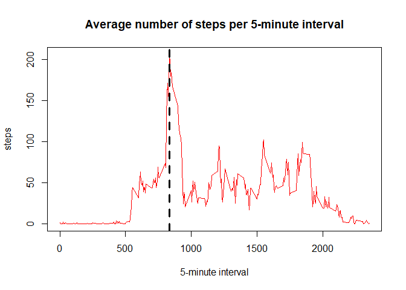

    knitr::opts_chunk$set(dev = c('png'), fig.path = 'figure/',echo = TRUE)

Reproducible research - Project 1
---------------------------------

This R Markdown document is the report for the Coursera course
Reproducible research - week 2. A simple set of data analysis tasks will
be performed.

First, reading in the data:

    steps <- read.csv("activity.csv")

Next, we will transform the date column to be of the type 'date'.

    steps$date <- as.Date(steps$date)

Mean total number of steps per day
----------------------------------

In the following tasks, we will ignore the NA.

Calculating the total number of steps taken per day:

    stepsPerDay <- aggregate(steps ~ date,data = steps, FUN = sum, na.action = na.omit )
    stepsPerDay

    ##          date steps
    ## 1  2012-10-02   126
    ## 2  2012-10-03 11352
    ## 3  2012-10-04 12116
    ## 4  2012-10-05 13294
    ## 5  2012-10-06 15420
    ## 6  2012-10-07 11015
    ## 7  2012-10-09 12811
    ## 8  2012-10-10  9900
    ## 9  2012-10-11 10304
    ## 10 2012-10-12 17382
    ## 11 2012-10-13 12426
    ## 12 2012-10-14 15098
    ## 13 2012-10-15 10139
    ## 14 2012-10-16 15084
    ## 15 2012-10-17 13452
    ## 16 2012-10-18 10056
    ## 17 2012-10-19 11829
    ## 18 2012-10-20 10395
    ## 19 2012-10-21  8821
    ## 20 2012-10-22 13460
    ## 21 2012-10-23  8918
    ## 22 2012-10-24  8355
    ## 23 2012-10-25  2492
    ## 24 2012-10-26  6778
    ## 25 2012-10-27 10119
    ## 26 2012-10-28 11458
    ## 27 2012-10-29  5018
    ## 28 2012-10-30  9819
    ## 29 2012-10-31 15414
    ## 30 2012-11-02 10600
    ## 31 2012-11-03 10571
    ## 32 2012-11-05 10439
    ## 33 2012-11-06  8334
    ## 34 2012-11-07 12883
    ## 35 2012-11-08  3219
    ## 36 2012-11-11 12608
    ## 37 2012-11-12 10765
    ## 38 2012-11-13  7336
    ## 39 2012-11-15    41
    ## 40 2012-11-16  5441
    ## 41 2012-11-17 14339
    ## 42 2012-11-18 15110
    ## 43 2012-11-19  8841
    ## 44 2012-11-20  4472
    ## 45 2012-11-21 12787
    ## 46 2012-11-22 20427
    ## 47 2012-11-23 21194
    ## 48 2012-11-24 14478
    ## 49 2012-11-25 11834
    ## 50 2012-11-26 11162
    ## 51 2012-11-27 13646
    ## 52 2012-11-28 10183
    ## 53 2012-11-29  7047

The table shows that that there are missing dates. These are left out on
purpose.

To gain more insight into the data, we will create a histogram
displaying the total number of steps for each day.

    hist(stepsPerDay$steps,
         main = "Number of steps per day",
         xlab = "Number of steps", 
         breaks = 10, 
         col = "grey",
         xlim = c(0,25000))

Now that we know the total number of steps per day, we are now
interested in the mean and median number of steps per day.

    stepsMean   <- aggregate(steps ~ date,data = steps, FUN = mean, na.action = na.omit )
    stepsMedian <- aggregate(steps ~ date,data = steps, FUN = median, na.action = na.omit )
    merged <- merge(stepsMean, stepsMedian, by = "date")
    names(merged) <- c("date","mean","median")
    merged

    ##          date       mean median
    ## 1  2012-10-02  0.4375000      0
    ## 2  2012-10-03 39.4166667      0
    ## 3  2012-10-04 42.0694444      0
    ## 4  2012-10-05 46.1597222      0
    ## 5  2012-10-06 53.5416667      0
    ## 6  2012-10-07 38.2465278      0
    ## 7  2012-10-09 44.4826389      0
    ## 8  2012-10-10 34.3750000      0
    ## 9  2012-10-11 35.7777778      0
    ## 10 2012-10-12 60.3541667      0
    ## 11 2012-10-13 43.1458333      0
    ## 12 2012-10-14 52.4236111      0
    ## 13 2012-10-15 35.2048611      0
    ## 14 2012-10-16 52.3750000      0
    ## 15 2012-10-17 46.7083333      0
    ## 16 2012-10-18 34.9166667      0
    ## 17 2012-10-19 41.0729167      0
    ## 18 2012-10-20 36.0937500      0
    ## 19 2012-10-21 30.6284722      0
    ## 20 2012-10-22 46.7361111      0
    ## 21 2012-10-23 30.9652778      0
    ## 22 2012-10-24 29.0104167      0
    ## 23 2012-10-25  8.6527778      0
    ## 24 2012-10-26 23.5347222      0
    ## 25 2012-10-27 35.1354167      0
    ## 26 2012-10-28 39.7847222      0
    ## 27 2012-10-29 17.4236111      0
    ## 28 2012-10-30 34.0937500      0
    ## 29 2012-10-31 53.5208333      0
    ## 30 2012-11-02 36.8055556      0
    ## 31 2012-11-03 36.7048611      0
    ## 32 2012-11-05 36.2465278      0
    ## 33 2012-11-06 28.9375000      0
    ## 34 2012-11-07 44.7326389      0
    ## 35 2012-11-08 11.1770833      0
    ## 36 2012-11-11 43.7777778      0
    ## 37 2012-11-12 37.3784722      0
    ## 38 2012-11-13 25.4722222      0
    ## 39 2012-11-15  0.1423611      0
    ## 40 2012-11-16 18.8923611      0
    ## 41 2012-11-17 49.7881944      0
    ## 42 2012-11-18 52.4652778      0
    ## 43 2012-11-19 30.6979167      0
    ## 44 2012-11-20 15.5277778      0
    ## 45 2012-11-21 44.3993056      0
    ## 46 2012-11-22 70.9270833      0
    ## 47 2012-11-23 73.5902778      0
    ## 48 2012-11-24 50.2708333      0
    ## 49 2012-11-25 41.0902778      0
    ## 50 2012-11-26 38.7569444      0
    ## 51 2012-11-27 47.3819444      0
    ## 52 2012-11-28 35.3576389      0
    ## 53 2012-11-29 24.4687500      0

The table clearly shows that the mean is known everywhere, though the
median is zero.

Average daily activity pattern
------------------------------

We will dive deeper into the number of steps, by looking at the 5-minute
intervals.

    stepsPerInterval <- aggregate(steps~interval, data = steps, FUN = mean, na.action = na.omit)
    with(stepsPerInterval, plot(interval, steps, type = "l", col = "red", xlab = "5-minute interval", main = "Average number of steps per 5-minute interval"))

    maxInterval <- stepsPerInterval[which.max(stepsPerInterval$steps),1]
    abline(v= maxInterval, lwd = 3, lty = 2)

The interval that has, on average, the highest number of steps is 835.

Imputing missing values
-----------------------

We know that there are missing values in the data set.

    missing <- sum(is.na(steps$steps))

The total number of NA values in the data set is 2304.

In order to fill in the missing values, we will use the average 5-minute
intervals to replace the missing values.

    idNA <- which(is.na(steps$steps))
    stepsFilled <- steps
    for( i in 1:length(idNA)) {
            stepsFilled[idNA[i],1] <- stepsPerInterval[which(stepsPerInterval$interval == steps[idNA[i],3]),2]        
    }

Using the dataset without the missing values, the histogram of the total
number of steps will look as follows:

    stepsPerDayFilled <- aggregate(steps ~ date,data = stepsFilled, FUN = sum, na.action = na.omit )
    hist(stepsPerDayFilled$steps,
         main = "Number of steps per day",
         xlab = "Number of steps", 
         breaks = 10, 
         col = "grey",
         xlim = c(0,25000))

The mean and median are then as follows:

    stepsFilledMean   <- aggregate(steps ~ date,data = stepsFilled, FUN = mean, na.action = na.omit )
    stepsFilledMedian <- aggregate(steps ~ date,data = stepsFilled, FUN = median, na.action = na.omit )
    mergedFilled <- merge(stepsFilledMean, stepsFilledMedian, by = "date")
    names(mergedFilled) <- c("date","mean","median")
    mergedFilled

    ##          date       mean   median
    ## 1  2012-10-01 37.3825996 34.11321
    ## 2  2012-10-02  0.4375000  0.00000
    ## 3  2012-10-03 39.4166667  0.00000
    ## 4  2012-10-04 42.0694444  0.00000
    ## 5  2012-10-05 46.1597222  0.00000
    ## 6  2012-10-06 53.5416667  0.00000
    ## 7  2012-10-07 38.2465278  0.00000
    ## 8  2012-10-08 37.3825996 34.11321
    ## 9  2012-10-09 44.4826389  0.00000
    ## 10 2012-10-10 34.3750000  0.00000
    ## 11 2012-10-11 35.7777778  0.00000
    ## 12 2012-10-12 60.3541667  0.00000
    ## 13 2012-10-13 43.1458333  0.00000
    ## 14 2012-10-14 52.4236111  0.00000
    ## 15 2012-10-15 35.2048611  0.00000
    ## 16 2012-10-16 52.3750000  0.00000
    ## 17 2012-10-17 46.7083333  0.00000
    ## 18 2012-10-18 34.9166667  0.00000
    ## 19 2012-10-19 41.0729167  0.00000
    ## 20 2012-10-20 36.0937500  0.00000
    ## 21 2012-10-21 30.6284722  0.00000
    ## 22 2012-10-22 46.7361111  0.00000
    ## 23 2012-10-23 30.9652778  0.00000
    ## 24 2012-10-24 29.0104167  0.00000
    ## 25 2012-10-25  8.6527778  0.00000
    ## 26 2012-10-26 23.5347222  0.00000
    ## 27 2012-10-27 35.1354167  0.00000
    ## 28 2012-10-28 39.7847222  0.00000
    ## 29 2012-10-29 17.4236111  0.00000
    ## 30 2012-10-30 34.0937500  0.00000
    ## 31 2012-10-31 53.5208333  0.00000
    ## 32 2012-11-01 37.3825996 34.11321
    ## 33 2012-11-02 36.8055556  0.00000
    ## 34 2012-11-03 36.7048611  0.00000
    ## 35 2012-11-04 37.3825996 34.11321
    ## 36 2012-11-05 36.2465278  0.00000
    ## 37 2012-11-06 28.9375000  0.00000
    ## 38 2012-11-07 44.7326389  0.00000
    ## 39 2012-11-08 11.1770833  0.00000
    ## 40 2012-11-09 37.3825996 34.11321
    ## 41 2012-11-10 37.3825996 34.11321
    ## 42 2012-11-11 43.7777778  0.00000
    ## 43 2012-11-12 37.3784722  0.00000
    ## 44 2012-11-13 25.4722222  0.00000
    ## 45 2012-11-14 37.3825996 34.11321
    ## 46 2012-11-15  0.1423611  0.00000
    ## 47 2012-11-16 18.8923611  0.00000
    ## 48 2012-11-17 49.7881944  0.00000
    ## 49 2012-11-18 52.4652778  0.00000
    ## 50 2012-11-19 30.6979167  0.00000
    ## 51 2012-11-20 15.5277778  0.00000
    ## 52 2012-11-21 44.3993056  0.00000
    ## 53 2012-11-22 70.9270833  0.00000
    ## 54 2012-11-23 73.5902778  0.00000
    ## 55 2012-11-24 50.2708333  0.00000
    ## 56 2012-11-25 41.0902778  0.00000
    ## 57 2012-11-26 38.7569444  0.00000
    ## 58 2012-11-27 47.3819444  0.00000
    ## 59 2012-11-28 35.3576389  0.00000
    ## 60 2012-11-29 24.4687500  0.00000
    ## 61 2012-11-30 37.3825996 34.11321

We can clearly see some differences in the median, which is not always
zero. Furthermore, the dates that had a 'NA' value, are now shown, which
were ignored in the previous table. The impact of of filling in the
missing values is that all days are now shown and not only a selection.
The pattern in the histogram is similar, but the frequency is higher.

differences in activity pattern between weekdays and weekends
-------------------------------------------------------------

There might be a difference in the activity pattern between weekdays and
the weekends. In order to investigate this, a new variable will be
created that displays whether the given date is a weekday or a weekend.

    Sys.setlocale("LC_ALL","English")

    ## [1] "LC_COLLATE=English_United States.1252;LC_CTYPE=English_United States.1252;LC_MONETARY=English_United States.1252;LC_NUMERIC=C;LC_TIME=English_United States.1252"

    stepsFilled$Weekday <- weekdays(stepsFilled$date)
    stepsFilled$daytype <- as.factor(ifelse(stepsFilled$Weekday %in% c("Saturday","Sunday"), "Weekend","Weekday"))

The panel plot below shows a time series plot of the 5-minute interval
average number of steps on weekdays and weekends.

    library(ggplot2)
    par(mfrow = c(1,2))
    stepsIntervalDaytype <- aggregate(steps~interval+daytype, data = stepsFilled, FUN = mean, na.action = na.omit)
    ggplot(stepsIntervalDaytype, aes(interval, steps,daytype)) +
            geom_line() +
            facet_wrap(~daytype, ncol =1) +
            labs(y = "number of steps", x = "5-minute interval")

The plot for the weekday shows a high peek at the start of the day. In
the weekends the average number of steps has more peeks.
